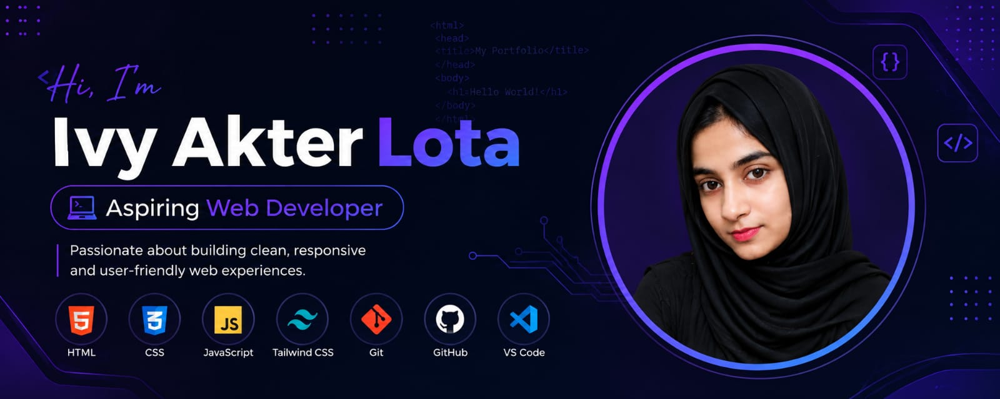

  

<h1 align="center">Hi 👋, I'm Ivy Akter Lota</h1>

<h3 align="center">
  💻 Aspiring Web Developer | Frontend Development Enthusiast
</h3>

  Passionate about building clean, responsive and user-friendly web experiences.

---

## 👩‍💻 About Me

- 🌱 I'm currently learning and improving my Web Development skills.
- 💻 I'm interested in Frontend Development and modern web technologies.
- 🎨 I enjoy creating clean and responsive user interfaces.
- 🚀 Currently practicing JavaScript and Tailwind CSS.
- 📚 Always trying to learn new technologies and improve my coding skills.
- 🤝 Interested in collaboration, learning and building projects.

---

## 🔭 Currently Working On

- 🌐 Practicing responsive web development
- 🎨 Building modern UI with Tailwind CSS
- ⚡ Improving my JavaScript skills
- 🚀 Building personal web development projects

---

## 🌱 Currently Learning

- JavaScript
- Tailwind CSS
- Responsive Web Design
- Git & GitHub
- Modern Web Development

---

## 🛠️ Skills & Technologies

### 💻 Frontend

  

### 🔧 Tools

  

---

## 📊 GitHub Stats

  

  

---

## 🚀 Projects

Here are some of the projects I'm working on and learning from:

## 🚀 Projects

Here are some of my projects:

### 🌐 Practise Projects
A collection of web development practice projects created while learning and improving my frontend development skills.

🔗 [GitHub Repository]https://github.com/ivyakterlotamoni/dev-stack
Live link:https://precious-clafoutis-16ecdf.netlify.app/

### 💻 Assignment 3
A JavaScript assignment project containing different problem-solving and programming practice tasks.

🔗 [GitHub Repository](https://github.com/ivyakterlotamoni/Assighnment3)

---

More projects coming soon! 🚀

---

## 📫 Connect With Me

---

## 🎯 My Goal

My goal is to become a skilled Web Developer and build useful, beautiful and user-friendly web applications.

> 💡 Keep learning, keep building, and keep improving.

---

  ⭐ Thanks for visiting my GitHub profile! ⭐

<!-- Footer -->

  

